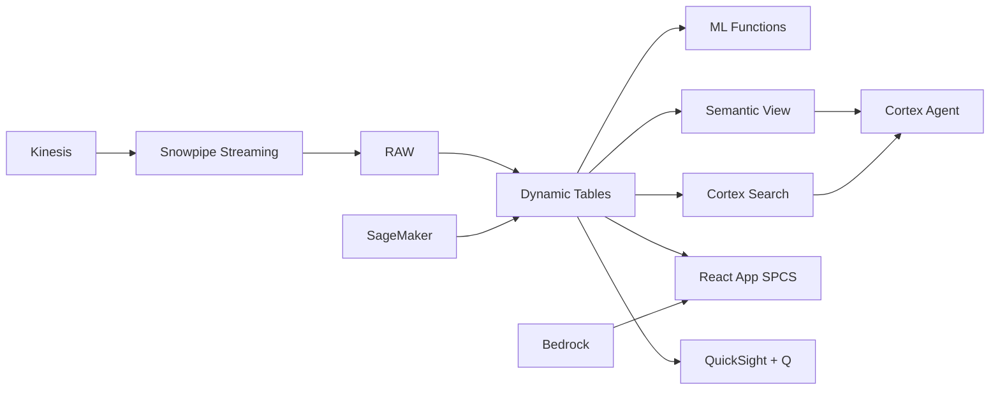

# Digital Lending & Credit Scoring Platform

Philippine digital lending grew 45% in 2023 — Snowflake builds applicant 360 profiles with Dynamic Tables, scores creditworthiness with ML.CLASSIFICATION, and enables real-time lending decisions at scale.

## Architecture

Philippine digital lending exploded in 2023 — growing 45% as GCash, Maya, and online banks made borrowing accessible. A Philippine universal bank processes 450,000 applications annually but struggles with fragmented data: credit bureau in one system, bank statements in another, employment verification in a third. Snowflake's Dynamic Tables build applicant 360 profiles in real-time, enabling ML-powered credit decisions in 4 hours instead of 3 days.



## Snowflake Capabilities

| Capability | Implementation |
|-----------|---------------|
| Dynamic Tables | APPLICANT_360 / PORTFOLIO_HEALTH / CREDIT_FEATURES / DECISION_METRICS |
| ML Functions | ML.CLASSIFICATION + ML.CLASSIFICATION |
| Cortex AI | COMPLETE, AI_CLASSIFY |
| Cortex Search | 85000 documents indexed |
| Cortex Agent | LENDING_INTELLIGENCE_AGENT |
| Semantic View | LENDING_ANALYTICS |
| React App (SPCS) | 5 tabs + DemoGuide |


## AWS Services

| Service | Role in Demo |
|---------|-------------|
| Amazon SageMaker | Credit scoring model training and deployment |
| Amazon Kinesis | Stream new loan applications in real-time |
| Amazon Bedrock (Claude) | Generate credit decision explanations for transparency |
| Amazon QuickSight + Q | Lending analytics and portfolio dashboards |
| AWS Glue | ETL for multi-source applicant data integration |
| Amazon DynamoDB | Low-latency applicant profile lookups |


## Personas

| Persona | Role | Key Questions |
|---------|------|---------------|
| **Victoria Isabel Zobel-Ayala** | Head of Consumer Lending | "What's our current NPL ratio by product?" "How fast are we processing loan applications?" |
| **Benedict Luis Sy Jr.** | Credit Risk Modeler | "What's the KS statistic for our latest model?" "Show me the score-to-default calibration chart." |


## Data

| Table | Rows | Description |
|-------|------|-------------|
| APPLICATIONS | 450,000 | 12 months of loan applications with demographics |
| BUREAU_DATA | 380,000 | Credit bureau records (CIC, TransUnion) |
| BANK_STATEMENTS | 1,200,000 | Uploaded bank statement data (6 months per applicant) |
| LOAN_PORTFOLIO | 285,000 | Active and closed loans with repayment history |
| COLLECTIONS | 42,000 | Delinquent accounts with collection activity |
| EMPLOYER_DATA | 85,000 | Verified employment data from DOLE/SSS |


## Build Instructions

### Prerequisites
- Snowflake account with ACCOUNTADMIN access
- Cortex AI enabled (ML Functions, Search, Agent)
- Warehouse: LENDING_WH (Medium)
- AWS CLI with access (us-west-2)

### Deployment

```bash
snowsql -f snowflake/00_setup.sql
snowsql -f snowflake/01_marketplace_install.sql
snowsql -f snowflake/02_raw_tables.sql
snowsql -f snowflake/03_staging.sql
snowsql -f snowflake/04_dynamic_tables.sql
snowsql -f snowflake/05_search.sql
snowsql -f snowflake/06_ml_models.sql
snowsql -f snowflake/07_semantic_view.sql
snowsql -f snowflake/08_agent.sql
```

### React App (SPCS)
```bash
cd app && npm ci && npm run build
docker build -t aws-philippines-banking-lending-app .
docker push bdiqc8sm-default.registry.snowflakecomputing.com/digital_lending/app/aws_philippines_banking_lending/app:latest
```

### Demo Mode
Open the app URL with `?demo=true` for presenter view.

## Build Modes

### Snowflake Only
Run scripts 00-08 (skip AWS-specific integration). Uses:
- **ML.CLASSIFICATION (native)** instead of Amazon SageMaker
- **Snowpipe Streaming SDK** instead of Amazon Kinesis
- **Cortex Complete** instead of Amazon Bedrock (Claude)
- **Snowflake Intelligence (Cortex Analyst)** instead of Amazon QuickSight + Q
- **Dynamic Tables (declarative pipelines)** instead of AWS Glue
- **Dynamic Tables (materialized, always fresh)** instead of Amazon DynamoDB

### Full AWS + Snowflake
Run all scripts including AWS integration. Deploy QuickSight dashboard from `quicksight/`.

## Business Impact

Industry research and Snowflake customer outcomes:
- **Philippine digital lending grew 45% in 2023 driven by fintech and online banks** — [BSP](https://www.bsp.gov.ph/SitePages/Statistics/Statistics.aspx)
- **AI-powered credit scoring improves lending decisions by 20-30% vs traditional scorecards** — [McKinsey Banking](https://www.mckinsey.com/industries/financial-services/our-insights)
- **Real-time data integration reduces time-to-decision by 70-90%** — [Accenture Banking](https://www.accenture.com/us-en/insights/banking)
- **Philippine banking NPL ratio was 3.4% in 2023 — digital lenders averaging 4-6%** — [BSP](https://www.bsp.gov.ph/SitePages/Statistics/Statistics.aspx)
- **Western Union** (Snowflake customer): processes 1B+ cross-border transactions on Snowflake with real-time compliance and fraud detection -- [snowflake.com/customers/western-union](https://www.snowflake.com/en/customers/all-customers/case-study/western-union/)

## Key Demo Numbers

- **₱48B** total lending portfolio
- **450,000** loan applications processed annually
- **4.2 hours** average time-to-decision for digital applications
- **3.8%** overall NPL ratio (below 5% threshold)
- **0.48 KS** credit scoring model discrimination power
- **68%** digital channel approval rate


## License

Apache 2.0 — See [LICENSE](LICENSE) for details.

This is a personal demo project and is not an official Snowflake offering. It comes with no support or warranty.